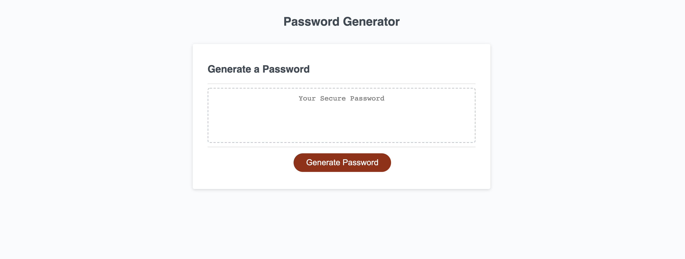

# Password-Generator

## About

    This password generator application enables users to generate random passwords with a variety of character choices to increase security with their passwords. The passwords are chosen completely randomly based on the users character preferences. It has a responsive user interface so users are able to use it on multiple screen sizes and on their mobile phones. I made use of HTML, CSS and Javascript to make sure that the application functions properly. I made sure that the character choice set are always changed after every password so they are never identical. It can be used by clicking on the generate password button and a series of prompts pops up on the screen so users can choose if they want to include numbers, lowercase letters, uppercase letters or symbols in their passwords. It helps to solve security problems users might be facing so they are able to make sure their favourite and confidential files are kept safe from any form of compromise. To use this application users must go to the website below:

 **https://daniel-ipymb.github.io/password_generator/**

  The images of the application are also shown below;

  
  
  
  
  
  
  
  
  
